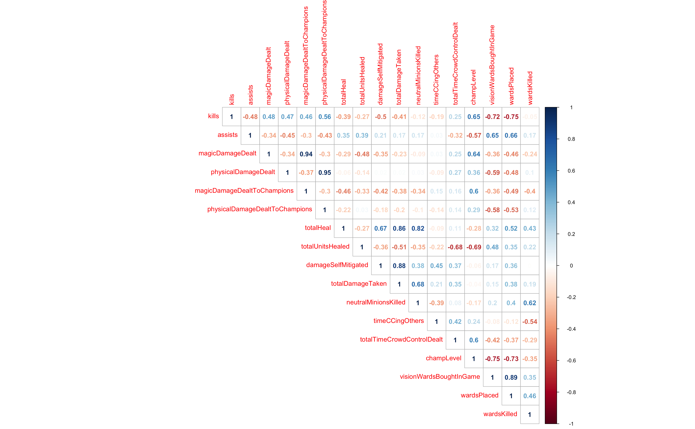

```{r setup, include=FALSE}
knitr::opts_chunk$set(echo = TRUE)
```

```{r include=FALSE}
library(factoextra)
library(tidyverse)
library(ggplot2)
library(knitr)
```


# Exploratory Data Analysis
在一场10人的英雄联盟的比赛中，每一支队伍各有5名选手参与，每一名选手在队伍中有各自的团队定位：上单(TOP)、打野(JUNGLE)、中路(MID)、下路(BOTCARRY)和辅助(SUPPORT)。**在这个EDA部分，我会用数据可视化的方式来详细分析2018年NALCS赛区春季赛数据，通过对团队定位的各项平均数据的分析，希望带大家从数据的角度了解一场比赛中的各个位置。**

## 探索选手的团队定位在比赛中的各项数据表现

```{r message=FALSE, include=FALSE}
# 读取数据
nalcs_matches_player_avgs <- read.csv("./datasets/nalcs/nalcs_spring2018_season_summoner_avgs.csv")
nalcs_plot_player_avgs <- nalcs_matches_player_avgs %>%
  filter(wins + losses >= 6) %>% 
  ggplot()
```

### 场均击杀
首先，我们根据团队定位来看一下场均击杀(Kills Per Game)的分布。
```{r}
nalcs_plot_player_avgs +
  geom_histogram(mapping = aes(x = kills, y = ..density.., fill = teamRole), 
                 color = "black", size = 0.5, alpha = .6, binwidth = .125) +
  labs(
    title = "Kills Per Game Histogram, NALCS 2018 Spring Split",
    subtitle = "Distribution of Kills")
```

```{r}
nalcs_plot_player_avgs +
  geom_density(mapping = aes(x = kills, color = teamRole, fill = teamRole), 
               alpha = .2, size = 0.5) +
  labs(
    title = "Kills Per Game Density Plot, NALCS 2018 Spring Split",
    subtitle = "Distribution of Kills Across Team Roles")
```

```{r}
nalcs_plot_player_avgs +
  geom_boxplot(mapping = aes(x = teamRole, y = kills, fill = teamRole), 
               size = 0.5, alpha = .6) +
  geom_jitter(width = 0.15, mapping = aes(x = teamRole, y = kills, color = teamRole)) +
  labs(
    title = "Kills Per Game Box Plot, NALCS 2018 Spring Split",
    subtitle = "Distribution of Kills Across Team Roles")
```

**从以上场均击杀的柱状图、密度图和箱线图中我们可以清楚的发现：在2018年的NALCS春季赛中，团队定位为辅助的选手拥有最低的场均击杀，其次是打野和上单；团队定位为中单和下路的选手拥有最高的场均击杀。**这其实符合我们的预期，辅助选手在比赛中的主要定位是保护、控制和提供视野等，而中单和下路（玩家口中的双C）选手的定位是输出，自然容易拥有更高的场均击杀。

### 场均死亡
接下来让我们根据团队定位看一看场均死亡(Deaths Per Game)的分布。
```{r}
nalcs_plot_player_avgs +
  geom_histogram(mapping = aes(x = deaths, y = ..density.., fill = teamRole), 
                 color = "black", size = 0.5, alpha = .6, binwidth = .125) +
  labs(
    title = "Deaths Per Game Histogram, NALCS 2018 Spring Split",
    subtitle = "Distribution of Deaths")
```

```{r}
nalcs_plot_player_avgs +
  geom_density(mapping = aes(x = deaths, color = teamRole, fill = teamRole), 
               alpha = .2, size = 0.5) +
  labs(
    title = "Deaths Per Game Density Plot, NALCS 2018 Spring Split",
    subtitle = "Distribution of Deaths Across Team Roles")
```

```{r}
nalcs_plot_player_avgs +
  geom_boxplot(mapping = aes(x = teamRole, y = deaths, fill = teamRole), 
               size = 0.5, alpha = .6) +
  geom_jitter(width = 0.15, mapping = aes(x = teamRole, y = deaths, color = teamRole)) +
  labs(
    title = "Deaths Per Game Box Plot, NALCS 2018 Spring Split",
    subtitle = "Distribution of Assists Across Team Roles")
```

从数据的角度我们可以发现：**相较于场均击杀，选手的场均死亡数会更相近一些；但是辅助选手和上单选手通常来说会死得更多一些。**

从游戏本身的角度来说(也是我个人的理解)：在一场比赛中，上路这条线很长，所以当兵线处于推进的过程非常容易遭遇敌方打野的gank，同时上路也是目前职业比赛在前期非常喜欢针对的一条路，所以会导致普遍来说上路选手的场均死亡会较高。而辅助选手场均死亡数高的原因有许多，一是辅助位吃团队最少的经济，等级低且装备差，通常是较为好击杀的一个位置；二是辅助位需要承担团队中做视野的责任，在做视野的过程中通常容易被针对击杀；三是辅助位通常起团队中开团或是保护C位的作用，献身冲阵打出控制和替C位挡技能都是导致死亡的重要原因。

因此，**辅助选手和上单选手拥有较高的场均死亡数**这个结论其实并不令人惊讶。


### 场均助攻
接下来，我们再来看一下场均助攻(Assists Per Game)数据的分布。

首先来解释一下什么是“助攻”：助攻可以理解为“帮助队友击杀”，无论是在一次击杀中贡献了一部分伤害，或是提供了控制还是治疗、护盾等buff，在那次击杀结束后都会增加一次助攻数。因此场均助攻我们可以理解为一名选手平均在一场游戏中辅助队友造成了多少次击杀，从另一个方面可以理解为选手参与战斗的积极程度(除开击杀本身)。

```{r}
nalcs_plot_player_avgs +
  geom_histogram(mapping = aes(x = assists, y = ..density.., fill = teamRole), 
                 color = "black", size = 0.5, alpha = .6, binwidth = .2) +
  labs(
    title = "Assists Per Game Histogram, NALCS 2018 Spring Split",
    subtitle = "Distribution of Assists")
```

```{r}
nalcs_plot_player_avgs +
  geom_density(mapping = aes(x = assists, color = teamRole, fill = teamRole), 
               alpha = .2, size = 0.5) +
  labs(
    title = "Assists Per Game Density Plot, NALCS 2018 Spring Split",
    subtitle = "Distribution of Assists Across Team Roles")
```

```{r}
nalcs_plot_player_avgs +
  geom_boxplot(mapping = aes(x = teamRole, y = assists, fill = teamRole), 
               size = 0.5, alpha = .6) +
  geom_jitter(width = 0.15, mapping = aes(x = teamRole, y = assists, color = teamRole)) +
  labs(
    title = "Assists Per Game Box Plot, NALCS 2018 Spring Split",
    subtitle = "Distribution of Assists Across Team Roles")
```

从上述图表中我们可以得出和场均击杀几乎相反的结论：**虽然辅助和打野选手并不擅长造成击杀，但是辅助和打野选手在场均助攻这项数据上拥有明显的领先。**

从游戏本身的理解来说：辅助和打野通常是大小团战的发起者，而且辅助英雄大多数拥有控制、治疗或护盾等技能，自然更容易增加自己的场均助攻数。而场均击杀数这项数据通常会由造成最多伤害的中单和下路获得。


### 其他数据
除了场均击杀、场均死亡、场均助攻这三项数据外，每个团队位置在比赛中还有更多的数据，以下我将分别展示NALCS2018春季赛选手场均数据的柱状图、密度图和箱线图。
```{r include=FALSE}
#### Facet-wrapped plots
nalcs_season_summoner_avgs_gathered <- nalcs_matches_player_avgs %>%
  gather(kills, assists, magicDamageDealt, physicalDamageDealt, magicDamageDealtToChampions,
         physicalDamageDealtToChampions, totalHeal, totalUnitsHealed, damageSelfMitigated, 
         totalDamageTaken, neutralMinionsKilled, timeCCingOthers, totalTimeCrowdControlDealt, 
         champLevel, visionWardsBoughtInGame, wardsPlaced, wardsKilled, key = "varName", 
         value = "valuePerGame")

# Template for next three plots
nalcs_plot_player_avgs_gathered <- nalcs_season_summoner_avgs_gathered %>%
  filter(wins + losses >= 6) %>%
  ggplot()
```

```{r fig10, fig.width=10, fig.asp=1.78, fig.align="center", message=FALSE}
# Histograms
nalcs_plot_player_avgs_gathered +
  geom_histogram(mapping = aes(x = valuePerGame, y = ..density.., fill = teamRole), 
                 color = "black", alpha = .6) +
  facet_wrap(~varName, scales = "free", ncol = 2) +
  labs(
    title = "Player Averages Per Game Histograms, NALCS 2018 Spring Split",
    subtitle = "Distribution of Values")
```

```{r fig11, fig.width=10, fig.asp=1.78, fig.align='center', message=FALSE}
nalcs_plot_player_avgs_gathered +
  geom_density(mapping = aes(x = valuePerGame, color = teamRole, fill = teamRole), 
               alpha = .3, size = 0.4) +
  facet_wrap(~varName, scales = "free", ncol = 2) +
  labs(
    title = "Player Averages Per Game Density Plots, NALCS 2018 Spring Split",
    subtitle = "Distribution of Values")
```

```{r fig12, out.width="100%", fig.width=12, fig.asp=2.00, fig.align='center', message=FALSE}
# Box Plots
nalcs_plot_player_avgs_gathered +
  geom_boxplot(mapping = aes(x = teamRole, y = valuePerGame, fill = teamRole), 
               size = 0.5, alpha = .6) +
  geom_jitter(width = 0.15, mapping = aes(x = teamRole, y = valuePerGame, color = teamRole)) +
  facet_wrap(~ varName, scales = "free", ncol = 5) +
  theme(axis.text.x = element_text(angle=30, vjust=0.6)) +
  labs(
    title = "Player Averages per Game Box Plots, NALCS 2018 Spring Split",
    subtitle = "Distribution Across Team Roles")
```


从以上的图表中我们可以发现每个位置的一些特点：

**上单**: 最少助攻, 最少对他人治疗，最多控制时间 

**打野**: 最多治疗, 最多承伤和减伤, 最高视野得分, 最多排眼, 击杀最多中立生物

**中单**: 造成最多魔法伤害, 最高等级

**下路**: 造成最多伤害, 造成最多物理伤害, 最少治疗, 最少承伤

**辅助**: 最少击杀, 造成最少伤害, 最多助攻, 最多对单位治疗, 购买最多眼, 最低等级


**因此，总的来说，在S8的NALCS的春季赛中，上单位通常作为首要承伤位和控制提供者，这在赛场中的体现即为选择科加斯、塞恩、奥恩这类可以提供团体控制的大坦克；打野位通常作为第二的承伤和控图位置，这在赛场中的体现便是选择特朗德尔、雷克赛、斯卡纳这类(半)坦克打野，打法也是偏控图为主；中单和下路双C在绝大多数版本的定位都是输出位，而中单更多提供团队的魔法输出(AP)，而下路基本都是提供物理输出(AD)的射手；辅助位通常则是提供团队的控制和对队友的保护，因此在S8的赛场上通常是锤石、布隆、洛、莫甘娜这类选择。**

看完了数据，我们来看一下赛场上真实的情况吧：

下图是2018NALCS春季赛的决赛，决赛的两只队伍是TL和C9，这两只队伍都是北美赛区的老牌强队，在第三场(也是决赛的最后一场)的比赛中双方BP的阵容如下：


在这场比赛中，TL和C9都选用了坦克上路，打野一边是偏向输出和控制的酒桶，一边是偏向控图和承伤的特朗德尔，中路都是AP输出大核，下路都是版本AD射手，辅助一边是偏向进攻和控制的锤石，一边是偏向保护和承伤的布隆。这样的BP选择是基本符合我们之前的分析的(也就是顺从当时版本的选择)。

### Some Fun Facts

**最高输出奖**
```{r}
nalcs_matches_player_avgs %>% 
  select(summonerName,teamRole, totalDamageDealtToChampions) %>% 
  arrange(desc(totalDamageDealtToChampions)) %>% 
  head(5) %>% 
  kable()
```

在整个s8NALCS春季赛中，100T的下路选手Cody Sun(孙哥)平均每场比赛能打超过28800点伤害，不愧为最高输出奖。同时我们发现在5个最高伤害的选手中，有4名都是下路。

**最能抗伤奖**
```{r}
nalcs_matches_player_avgs %>% 
  select(summonerName,teamRole, totalDamageTaken) %>% 
  arrange(desc(totalDamageTaken)) %>% 
  head(5) %>% 
  kable()
```

在整个S8NALCS春季赛中，最能抗伤害的非CLG打野选手Reignover莫属，他平均每场能抗超过39000点伤害。令人惊讶的是，和上单比起来，这个赛季似乎打野位才是真正的(最能)抗伤的位置。

**北美法王奖**
```{r}
nalcs_matches_player_avgs %>% 
  select(summonerName,teamRole, magicDamageDealtToChampions) %>% 
  arrange(desc(magicDamageDealtToChampions)) %>% 
  head(5) %>% 
  kable()
```

在整个S8NALCS春季赛中，TSM的中单Bjergsen选手以场均22514点AP输出荣获北美法王奖，不愧是带着4颗真眼打比赛的院长，致敬。


# 机器学习模型

在这个部分，我将使用聚类算法中的KMeans和分类算法KNN来从侧面验证我们从数据可视化中得到的线索：不同位置的选手在比赛中的各项数据是带有某些“特征”的，而且我们也许可以在不知道选手位置的情况下根据这些“特征”来对选手的位置进行预测分类。

## 数据中可用的特征

在这个部分我选取了2018NALCS春季赛各选手最具代表性的17个特征，它们分别为：

```{r echo = FALSE, results = "asis"}
library(knitr)
variableName <- c("kills", "assists", "magicDamageDealt", "physicalDamageDealt", 
                  "magicDamageDealtToChampions", "physicalDamageDealtToChampions", 
                  "totalHeal", "totalUnitsHealed", "damageSelfMitigated", "totalDamageTaken",  
                  "neutralMinionsKilled", "timeCCingOthers", "totalTimeCrowdControlDealt", 
                  "champLevel", "visionWardsBoughtInGame", "wardsPlaced", "wardsKilled")
description <- c("击杀数，即选手在一场比赛中造成的击杀数量", 
"助攻数，即选手在一场比赛中造成的助攻数量", 
"造成的魔法伤害，即选手在一场比赛中造成的累计魔法伤害，包括对敌方英雄、防御塔和中立生物等", 
"造成的物理伤害，即选手在一场比赛中造成的累计物理伤害，包括对敌方英雄、防御塔和中立生物等", 
"对英雄造成的魔法伤害，即选手在一场比赛中对敌方英雄造成的累计魔法伤害",
"对英雄造成的物理伤害，即选手在一场比赛中对敌方英雄造成的累计物理伤害", 
"治疗总量，即选手在一场比赛中获得的治疗总量", 
"单位治疗总量，即选手在一场比赛中对友方英雄、自己、友方建筑、小兵的治疗数量", 
"减伤，即选手在一场比赛中通过护盾、护甲、魔抗等方式减少的伤害量", 
"总承伤，即选手在一场比赛中承受来源于敌方英雄、防御塔、小兵、中立生物等的总伤害", 
"中立生物击杀数，即选手在一场比赛在击杀的中立生物的总数量", 
"控制时间，即除去硬控外的控制时间(如软控制和减速)", 
"总控制时间，即选手在一场比赛中提供的硬控制时间总和", 
"英雄等级，即选手在比赛结束时的英雄等级", 
"真视守卫购买数，即选手在一场比赛中购买的真眼的数量", 
"视野数量，即选手在一场比赛中放下的眼的数量(包括真眼和假眼)", 
"排眼数量，即选手在一场比赛中排除的眼的数量(包括真眼和假眼)")
df_vars <- data.frame(variableName, description)
kable(df_vars)
```


## KMeans聚类模型

### 数据准备

首先我们先来加载s8春季赛各赛区选手的平均数据，之后再合并成大的数据集，在这个数据集中，我们可以找到各赛区的各位选手在整个春季赛的平均数据。注：在这里我们只关注上场超过6次的选手。

```{r echo=T, results='hide', warning=FALSE}
# Import averages data for all available leagues
nalcs_season_summoner_avgs <- read.csv("./datasets/nalcs/nalcs_spring2018_season_summoner_avgs.csv") %>% 
  select(-X) 
eulcs_season_summoner_avgs <- read.csv("./datasets/eulcs/eulcs_spring2018_season_summoner_avgs.csv") %>% 
  select(-X)
lck_season_summoner_avgs <- read.csv("./datasets/lck/lck_spring2018_season_summoner_avgs.csv") %>% 
  select(-X)
lms_season_summoner_avgs <- read.csv("./datasets/lms/lms_spring2018_season_summoner_avgs.csv") %>% 
  select(-X)

# Putting all leagues together
all_leagues_summoner_avgs <-
  eulcs_season_summoner_avgs %>%
  bind_rows(lms_season_summoner_avgs) %>%
  bind_rows(lck_season_summoner_avgs) %>%
  bind_rows(nalcs_season_summoner_avgs) %>%
  # Removing players who haven't played at least six games.
  filter(wins + losses >= 6) 
str(all_leagues_summoner_avgs %>% select(1:10))

remove(nalcs_season_summoner_avgs, eulcs_season_summoner_avgs, lck_season_summoner_avgs, lms_season_summoner_avgs)
```


### 数据预处理

在训练模型之前，预处理数据是非常重要的一步。首先，我们先选择之前我们提到过的17个特征：

```{r}
data_selected <- all_leagues_summoner_avgs %>%
  select(kills, assists, magicDamageDealt, physicalDamageDealt, 
         magicDamageDealtToChampions, physicalDamageDealtToChampions, 
         totalHeal, totalUnitsHealed, damageSelfMitigated, totalDamageTaken, 
         neutralMinionsKilled, timeCCingOthers, totalTimeCrowdControlDealt, 
         champLevel, visionWardsBoughtInGame, wardsPlaced, wardsKilled)
```

再来检查一下数据中是否含有缺失值：
```{r comment=""}
any(is.na(data_selected))
```

由于我们选择的17个特征都是数值型变量，我们可以先看看它们之间的**关系矩阵(correlation matrix)**：
两个变量间的相关系数的绝对值越大说明两个变量间的线性关系越强，说明两者可能包含了较多重复的信息，为了简化模型同时防止过拟合，我们只需要在包含大量重复信息的变量中选择其一即可。在这里我会特别关注相关系数大于0.85的变量。

```{r eval=FALSE, fig.width=8, warning=FALSE, include=FALSE, results='hide'}
library(corrplot)
d <- cor(data_selected)
corrplot(d, method = "number", type = "upper")
```


因此，我们在"magicDamageDealt"和"magicDamageDealtToChampions"中选择"magicDamageDealtToChampions"；

在"physicalDamageDealt"和"physicalDamageDealtToChampions"中选择"physicalDamageDealtToChampions"；

在"totalHeal"和"totalDamageTaken"中选择"totalDamageTaken"；

在"damageSelfMitigated"和"totalDamageTaken"中选择"totalDamageTaken"；

在"visionWardsBoughtInGame"和"wardsPlaced"中选择"wardsPlaced"。

```{r}
data_selected_2 <- all_leagues_summoner_avgs %>%
  select(kills, assists, magicDamageDealtToChampions, physicalDamageDealtToChampions, 
         totalUnitsHealed, totalDamageTaken, neutralMinionsKilled, timeCCingOthers, 
         totalTimeCrowdControlDealt, champLevel, wardsPlaced, wardsKilled)
```

### Z-Score Standardization

**为了保证各个特征的尺度一致，在训练KMeans模型之前我们需要标准化各个特征，这里我们使用Z-Score Standardization来标准化数据。**

```{r}
data_scaled <- data_selected_2 %>% scale()
```


### 训练、评估模型

```{r}
set.seed(1234)
k <- kmeans(data_scaled, centers = 5, nstart = 25)
fviz_cluster(k, data = data_scaled)
```

```{r}
set.seed(123)
fviz_nbclust(data_scaled, kmeans, method = "wss")
```

```{r}
set.seed(123)
fviz_nbclust(data_scaled, kmeans, method = "silhouette")
```

```{r include=FALSE}
cluster <- k$cluster
result <- cbind(all_leagues_summoner_avgs, cluster)
```


```{r echo=FALSE}
result %>% 
  select(teamRole, cluster) %>% 
  group_by(cluster, teamRole) %>% 
  tally() %>% 
  kable()
```

在所有的聚类结果中，KMeans算法只把EEW战队的中单SSUN选手归到上单这个聚类中，其余所有选手都被分到了与其位置对应的聚类中了，可以说KMeans算法从侧面证明了5个位置的选手在比赛的数据上有所区别，并且每个位置有其独特的特点。

```{r}
result %>% 
  select(summonerName, teamRole, cluster) %>% 
  filter(cluster == 2) %>% 
  filter(teamRole == "MID") %>% 
  kable()
```


## KNN分类模型

既然KMeans算法已经从侧面说明了5个位置的选手在比赛中的分别有其独特的数据特点，那么我们是否可以构造一个机器学习的分类模型，使得我们输入某一位选手在某一场比赛中的各项数据，让分类器根据各个位置的数据特点来对该名选手的位置(团队定位)进行分类？

### 数据准备

首先我们先来加载s8春季赛各赛区每一场比赛的数据，之后再合并成大的数据集，在这个数据集中，我们可以找到某一选手在某一场比赛中的各项详细数据。

```{r echo=T, results='hide', warning=FALSE}
nalcs_season_match_player_stats <- read.csv("./datasets/nalcs/nalcs_spring2018_match_player_stats.csv") %>% select(-X)
eulcs_season_match_player_stats <- read.csv("./datasets/eulcs/eulcs_spring2018_match_player_stats.csv") %>% select(-X)
lck_season_match_player_stats <- read.csv("./datasets/lck/lck_spring2018_match_player_stats.csv") %>% select(-X)
lms_season_match_player_stats <- read.csv("./datasets/lms/lms_spring2018_match_player_stats.csv") %>% select(-X)
msi_season_match_player_stats <- read.csv("./datasets/msi/msi_2018_match_player_stats.csv") %>% select(-X)

all_leagues_match_player_stats <-
  nalcs_season_match_player_stats %>%
  bind_rows(eulcs_season_match_player_stats) %>%
  bind_rows(lck_season_match_player_stats) %>%
  bind_rows(lms_season_match_player_stats) %>%
  bind_rows(msi_season_match_player_stats) %>%
  mutate(roleLane = paste(role, lane, sep = ", "))
str(all_leagues_match_player_stats %>% select(1:10))

remove(nalcs_season_match_player_stats, eulcs_season_match_player_stats, lck_season_match_player_stats, lms_season_match_player_stats, msi_season_match_player_stats)
```


```{r comment=""}
all_leagues_match_player_stats %>% 
  dim()
```


### 数据预处理

#### 特征选择
由于之前KMeans的聚类效果很不错，这里我打算直接使用之前的特征。

```{r}
player_selected <- all_leagues_match_player_stats %>%
  select(kills, assists, magicDamageDealtToChampions, physicalDamageDealtToChampions, 
         totalUnitsHealed, totalDamageTaken, neutralMinionsKilled, timeCCingOthers, 
         totalTimeCrowdControlDealt, champLevel, wardsPlaced, wardsKilled)
```

#### Min-Max Normalization

**为了保证各个特征的尺度一致，在使用KNN模型之前我们需要标准化各个特征，这里我们使用Min-Max Normalization来标准化数据。**

```{r}
normalize <- function(x) {
return ((x - min(x)) / (max(x) - min(x))) }
```

```{r}
player_scaled <- normalize(player_selected)
```


#### 训练集、测试集划分

我们将数据集中的70%用于训练，剩余的30%用于测试。

```{r message=FALSE, warning=FALSE}
# Split dataset into training and testing
library(caret)
set.seed(1234)
train_index <- caret::createDataPartition(all_leagues_match_player_stats$teamRole, p = 0.7, list = FALSE, times = 1)
train_data <- player_scaled[train_index,]
test_data <- player_scaled[-train_index,]
train_label <- all_leagues_match_player_stats[train_index,]$teamRole
test_label <- all_leagues_match_player_stats[-train_index,]$teamRole
```


### 训练、测试模型

```{r}
dim(train_data)
```

由于我们训练集中有4875个数据，根据经验法，我们先尝试设置K = $\sqrt{4875} \approx 70$ 

```{r}
library(class)
knn <-  knn(train=train_data, test=test_data, cl=train_label, k=70)
knn.10 <-  knn(train=train_data, test=test_data, cl=train_label, k=10)
```

```{r}
table(knn, test_label) %>% 
  kable(caption = "KNN(left) VS Test Label(top)")
```

```{r comment=""}
library(caret)
confusionMatrix(knn, test_label)
```

```{r include=FALSE}
i=1                          # declaration to initiate for loop
k.optm=1                     # declaration to initiate for loop
for (i in 1:100){ 
    knn.mod <-  knn(train=train_data, test=test_data, cl=train_label, k=i)
    k.optm[i] <- 100 * sum(test_label == knn.mod)/NROW(test_label)
    k=i  
    cat(k,'=',k.optm[i],'\n')       # to print % accuracy 
}
```

```{r}
plot(k.optm, type="b", xlab="K- Value",ylab="Accuracy level") 
```

K = 10时准确率最高达到85.94724%。

```{r comment=""}
confusionMatrix(knn.10, test_label)
```

**在上述表格当中，值得注意的是：对TOP(上路)这个位置的预测相对于其他位置有明显更低的Sensitivity。查阅`Caret`包的document我们可以知道这里的Sensitivity即Recall(查全率)，指的是被正确检索的样本数与应当被检索的样本总数之比。也就是说，相比于其他位置，上单选手的数据常常被错误地分类到了其他位置。**

根据之前的混淆矩阵，我们发现上单选手有较多部分被分类为辅助和打野，小部分被分类为中单和下路，这引起了我们的思考：**我们是否可以加入一些其他的特征来更加细化地区分上单和其他位置？**

在这里我们尝试构建一个新的特征和加入三个新特征：

```{r echo=FALSE, results='asis'}
newVarName <- c("physDmgToChampsToDmgTakenRatio", "totalMinionsKilled", 
                  "damageTakenPerMinDeltas.0.10", "creepsPerMinDeltas.0.10")
newDescription <- c("对英雄物理输出 / 总承伤，用以区分上单和下路/中单", 
"敌方小兵击杀数量，用以区分上单和打野/辅助", 
"前十分钟每分钟承伤，用以区分上单和打野", 
"前十分钟每分钟击杀敌方小兵数量，用于区分上单和辅助/打野")
df_new_vars <- data.frame(newVarName, newDescription)
kable(df_new_vars)
```

```{r}
all_leagues_match_player_stats <- all_leagues_match_player_stats %>%
  mutate("physDmgToChampsToDmgTakenRatio" = physicalDamageDealtToChampions / totalDamageTaken)

player_selected <- all_leagues_match_player_stats %>%
  select(kills, assists, magicDamageDealtToChampions, physicalDamageDealtToChampions, 
         totalUnitsHealed, totalDamageTaken, neutralMinionsKilled, timeCCingOthers, 
         totalTimeCrowdControlDealt, champLevel, wardsPlaced, wardsKilled, totalMinionsKilled, damageTakenPerMinDeltas.0.10, 
         physDmgToChampsToDmgTakenRatio, creepsPerMinDeltas.0.10)

player_scaled <- normalize(player_selected)

set.seed(1234)
train_index <- caret::createDataPartition(all_leagues_match_player_stats$teamRole, p = 0.7, list = FALSE, times = 1)
train_data <- player_scaled[train_index,]
test_data <- player_scaled[-train_index,]
train_label <- all_leagues_match_player_stats[train_index,]$teamRole
test_label <- all_leagues_match_player_stats[-train_index,]$teamRole
```

```{r}
knn <-  knn(train=train_data, test=test_data, cl=train_label, k=10)
```


```{r}
table(knn, test_label) %>% 
  kable(caption = "KNN(left) VS Test Label(top)")
```

```{r comment=""}
confusionMatrix(knn, test_label)
```

通过观察新的混淆矩阵我们发现，加入了新的特征之后，其他位置的数据没有明显变化，但上单的查全率有略微的提升(2%)，同时模型的准确率也有略微的提升。

接下来让我们看一下究竟是哪些上单英雄被错误地分类成了其他位置吧：
```{r echo=FALSE, message=FALSE, results = "asis"}
all_leagues_match_player_stats_with_pred <- all_leagues_match_player_stats[-train_index,]
all_leagues_match_player_stats_with_pred["teamRole"] <- test_label
all_leagues_match_player_stats_with_pred["predTeamRole"] <- knn

fn_top_table <- all_leagues_match_player_stats_with_pred %>% 
  filter(teamRole == "TOP") %>% filter(predTeamRole != "TOP")
kable(table(fn_top_table$name, fn_top_table$predTeamRole), 
      caption = "False Negative Top Laner Champions vs Predicted Role")
```

由上表我们可以看出，**上单选手在分类上拥有较低查全率的原因很大部分源于S8春季赛上单英雄的选择的跨度很大还有英雄本身的原因。**例如Cassiopeia, Ryze, Swain, Vladimir,  Kassadin这类法师，在绝大部分情况下都是典型的中路法师，因此上单选手在选择后也通常会表现得和大多中路选手一样，高AP输出、高吃兵数、高经验等；而Gnar, Gangplank, Jayce同理，本身的英雄属性就非常接近下路的射手，因此数据上表现的相似也是理所因当。Camille, Cho'Gath, Irelia, Jax, Ornn, Shen此类上单英雄我个人则是认为他们本身拥有非常强力的控制或减速，表现得很像S8春季赛出场非常多的控图打野比如Sejuani, Trundle, Skarner等，使得模型误分类。当然，此外也要考虑选手本身在赛场发挥的因素。


# 总结

**通过EDA的数据可视化，我们发现了各个位置的选手在比赛中的数据上似乎是有各自的“特征”的；而我们也通过了KMeans聚类算法，在不提供选手的团队位置这个标签的情况下发现，如果按照团队位置的先验知识(选择K=5)，最后的聚类结果是非常符合我们预期的；最后，我们利用KNN分类算法成功地建立了一个根据比赛数据给选手按团队位置分类的分类器，分类的准确率约为86%。**


